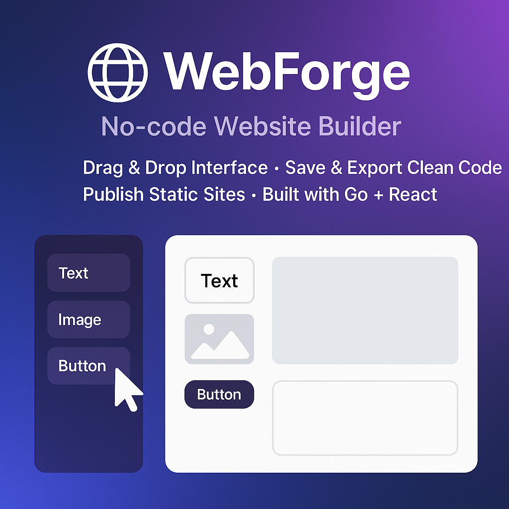

# WebForge



WebForge is a powerful No-Code Website Builder that enables users to create beautiful, responsive websites without writing a single line of code. Built with modern web technologies and a focus on user experience, WebForge makes website creation accessible to everyone.

## Features

- 🎨 Drag-and-drop interface for intuitive website building
- 📱 Responsive design that works on all devices
- 🎯 Pre-built components and templates
- 🔧 Customizable themes and styles
- 🚀 Fast performance and optimized builds
- 🔒 Secure and reliable hosting options

## Getting Started

### Prerequisites

- Node.js (v18 or higher)
- pnpm (recommended package manager)

### Installation

1. Clone the repository:
```sh
git clone https://github.com/yourusername/webforge.git
cd webforge
```

2. Install dependencies:
```sh
pnpm install
```

3. Start the development server:
```sh
pnpm dev
```

## Project Structure

This monorepo contains the following packages:

- `web`: The main Next.js application for the website builder interface
- `docs`: Documentation site built with Docusaurus

## Development

### Building

To build all apps and packages:

```sh
pnpm build
```

### Development Mode

To run the development environment:

```sh
pnpm dev
```

## Contributing

We welcome contributions to WebForge! Please read our contributing guidelines before submitting pull requests.

## License

This project is licensed under the MIT License - see the LICENSE file for details.

## Support

For support, please open an issue in the GitHub repository or contact our support team.

---

Built with ❤️ by the WebForge team
